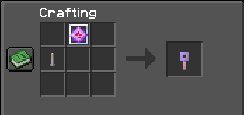

# MineChell
Official Bukkit plugin for the EFSC

## Features

### Sit: Right-click on a chair to take a seat!
- Must use empty hand on the top-facing part of a block
- A chair is a bottom slab or bottom stair with at least one adjacent sign or trapdoor
- A chair must have a solid block (that you could stand on) underneath, and a non-opaque block above.
- 1-second cooldown on sitting in a chair
### Hat: Put any item on your head!
- Use /hat while holding the item in your main hand
- If you're already wearing something on your head, it'll be swapped with your hand
### Invisible ItemFrames & Armor Stands!
- Shoot an invis arrow to make them invisible!
- The ItemFrame must be filled & ArmorStand must be carrying 1 item (armor or hands) for this to work
- Use a splash water bottle to make them visible again! Also works on other entities!
- If you remove all visible items, the invisible ItemFrame/ArmorStand will break off
### Armor Stands: Arms & Poses!
- Sneak + Use 2 sticks to add arms to an armor stand in the world
- Sneak + Use shears to break the arms off again
- Sneak + Use a pickaxe to remove the armor stand base plate
- Sneak + Use a smooth stone slab to add the base plate again
- Sneak + Use a music disc to set the armor stand pose! Discs are not consumed.
### Tag!
- Use `/tag join` and `/tag leave` to opt in or out
- Use `/tag online` and `/tag list` to get all (online) players opted in
- OPs can use `/tag set` to override the current tagged player
- All players can use `/tag vote` and `/tag unvote` to vote to choose a new random (online, opted in) player to be it.
    - Requires 3 players to vote, unless there's only 2 players on the server.
### Custom Player Heads!
- Players drop Player Heads upon death by a charged creeper!
- There may be a way to make this less painful...
- Wandering Traders will sometimes spawn with a trade to exchanged any Player Head for a Cleaned Player Head!
- Cleaned Player Heads can be set to any texture using `/head <texture>`, where texture can be a player name, a player UUID, or a base64 texture Value.

As an example, if you find a custom Player Head texture online with the following `/give` command:
```
/give @p minecraft:player_head{display:{Name:'{"text":"Egg Basket"}'},SkullOwner:{Id:[I;-500756633,1072776469,-1810775331,-1238834379],Properties:{textures:[{Value:"eyJ0ZXh0dXJlcyI6eyJTS0lOIjp7InVybCI6Imh0dHA6Ly90ZXh0dXJlcy5taW5lY3JhZnQubmV0L3RleHR1cmUvYzE2ZDdiMjMyYjhkN2M3MWIxZDRlOTk3YzJkMWEyNGVjOTk3ODc4MWU1OTdmYTI1MWExMGFmNTUxZTBmMjRmNyJ9fX0="}]}}} 1
```
The portion inside `Value:"<texture>"` is what you need, ie you would run the following command:
```
/head eyJ0ZXh0dXJlcyI6eyJTS0lOIjp7InVybCI6Imh0dHA6Ly90ZXh0dXJlcy5taW5lY3JhZnQubmV0L3RleHR1cmUvYzE2ZDdiMjMyYjhkN2M3MWIxZDRlOTk3YzJkMWEyNGVjOTk3ODc4MWU1OTdmYTI1MWExMGFmNTUxZTBmMjRmNyJ9fX0=
```

### Turbo Encabulator!

- Craft using an End Crystal diagonally-above an End Rod.
- Sneak + Use on an armor stand to cycle through all poses.
- Sneak + Use on a block to copy its state, and Use to paste on other similar blocks.
    - Works on: Stairs, Slabs, Fences, Furnaces

### Carry players!
- Right-click with empty hand on a player with a saddle in their helmet slot to ride.
- If you're carrying a player, sneak-left-click to eject them in the direction you're looking.

### Help
- Use `/minechell` in-game to get a link back to this document at any time!

## TODO
- [x] add some kind of wrench (debug stick), limited to only stairs/fences/etc
- [ ] chat channels
- [ ] /yoink and /unyoink
- [ ] Tag: require shown on dynmap
- [ ] Tag scoreboard: who's currently it, how long they've been it
- [ ] markdown syntax in chat messages
- [ ] Trident retrieve items
